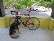
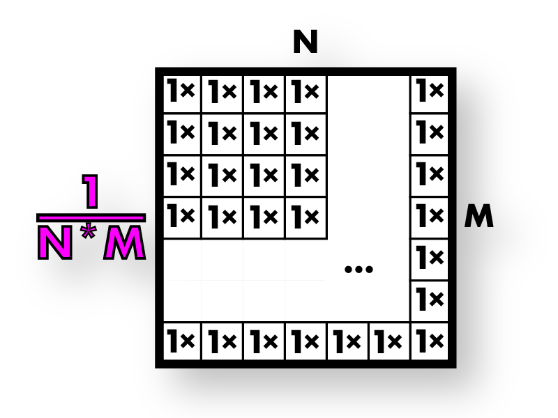
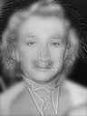
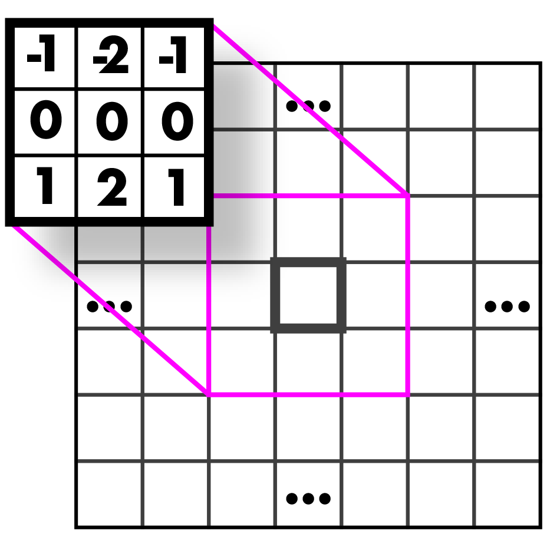
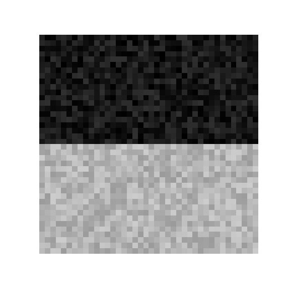

### Disclamer: This lab is heavily based on the CSE 576 homework that you can find here: ###

#### https://github.com/holynski/cse576_sp20_hw2 ####

I file su cui lavorerete sono `resize_image.cpp`e `filter_image.cpp`. Il
repository funziona come nel caso dell'esercizio 1, potete seguire le stesse
indicazioni per il set-up. In questo esercizio avrete bisogno del file che avete
completato nel primo esercizion, `process_image.cpp`. Copiatelo in nella
castella 'src'. Invece `access_image.cpp`
non ci servirà perché le sue funzionalità sono state inserite in `image.h` nella
struttura Image.

## 1. Image resizing ##

Nella lezione abbiamo parlato del ridimensionamento e interpolazione. In questo
esercizio implementerete i metodi di interpolazione e poi creerete una funzione
che crei una nuova immagine che verrà riempita usandoli.

- Completate `float Image::pixel_nearest(float x, float y, int c) const;`
  contenuto in `src/resize_image.cpp`.
    - Dovrebbe calcolare l'interpolazione nearest neighbour. Ricordate di usare
      l'intero più vicino, non solo il cambio di tipo automatico che in C
      troncherebbe la parte decimale.
    - Nota: fate attenzione ad usare la notazione sulle coordinate usata a
      lezione, o i test non passeranno anche nel caso di un'implementazinoe
      metodologicamente corretta. Usate la funzione
      membro `clamped_pixel(a,b,c)` invece dell'operatore `()`.
- Riempite `Image nearest_resize(const Image& im, int w, int h);. Questo
  dovrebbe:
    - Creare una nuova immagine `w x h` con lo stesso numero di canali di `im
    - Ciclare tutti i pixel e mapparli alle vecchie coordinate
    - Usarer nearest neighbour per riempire l'immagine

Il vostro codice prenderà come input l'immagine:

e la trasformerà in:

Finito con questa funzione, fate lo stesso con le altre due per l'interpolazione
bilineare:

    float Image::pixel_bilinear(float x, float y, int c) const;
    Image bilinear_resize(const Image& im, int w, int h);

Il risultato finale del test `test_bl_resize` dovrebbe essere questo:

Queste funzioni vanno bene per ingrandire un immagine, ma se vogliamo
rimpicciolirla potremmo avere dei problemi di aliasing, come abbiamo visto a
lezione. Infatti il risultato delle operazioni del test saranno molto rumorose:

Come detto a lezione dobbiamo filtrare, prima di ridurre!

## 2. Filtraggio delle immagini usando le convoluzioni ##

Inizieremo filtrando l'immagine con un box filter. Ci sono modi più veloci di
fare questo, ma noi lo implementeremo in maniera naif con una convoluzione,
perché sarà lo stesso modo con cui opereremo i filtri successivi.

### 2.1 Create il vostro box-filter ###

Il box filter che abbiamo visto a lezione può essere rappresentato così:

un modo per implementarlo è creare un'immagine, riempirla con 1 e poi
normalizzarla. Quindi la prima funzione che realizzeremo è proprio quella di
normalizzazione.

Completate `void l1_normalize(Image& im)` contenuto in `filter_image.cpp`.
Questo dovrebbe normalizzare la somma dei pixel dell'immagine a 1.

Quindi completate `Image make_box_filter(int w)` contenuto
in `filter_image. cpp`. Useremo sono box-filter quadrati, quindi la dimensione
sarà `w x w` e avrà un solo canale i cui pixel dovranno sommare a 1.

### 2.2 Scrivete la funzione di convoluzioe ###

**Chiamiamo questa funzione convoluzione, ma per essre matematicamente corretti
dovremmo ribaltare il filtro. In realtà stiamo implementando una
cross-correlazione, ma vista la simmetria dei filtri non fa differenza. **
Dovete implementare la formula discussa in classe:

Completate `Image convolve_image(const Image& im, const Image& filter, bool preserve)`
. Per questa funzine ci sono due possibilità. Con le convoluzioni normali
facciamo una somma pesata su un'area dell'immagine. Con più canali teniamo conto
di più possibilità:

- Se il parametro `preserve` è impostato a `true`, la funzioe dovrebbe produrre
  un immagine con lo stesso numero di canali dell'input. Questo è utile per
  esempio, se vogliamo applicare il box-filter ad un'immagine RGB per ottenere
  un'altra immagine RGB. Questo significa che ogni canale verrà filtrato
  separatamente dallo stesso kernel.
- Se `preserve` è a `false` dovremmo ritornare un'immagine con un solo canale
  prodotto applicndo il filtro and ogni canale e poi summandoli insieme in un
  unico canale.

Naturalmente, `filter` dovrebbe avere 1 canale. C'è un `assert` nel codice che
verifica questo. Quando avete finito, testate la convoluzione applicando il
filtro alla nostra immagine (`test_convolution` dentro `test1.cpp`).

L'output dovrebbe essere questo:

Ora possiamo effettuare l'operazine di ridiuzione dell'immagine:

Potete vedere quanto è migliorata!

Resize                     |  Blur e Resize
:-------------------------:|:-------------------------:
    | 

### 2.3 Altri filtri ###

Completate le funzioni `Image make_highpass_filter()`
, `Image make_sharpen_filter()`, e `Image make_emboss_filter()`. Il primo lo
abbiamo visto a lezione, gli altri due sono nuovi.

Highpass                   |  Sharpen                  | Emboss
:-------------------------:|:-------------------------:|:--------------------|
     |      | 
:-------------------------:|:-------------------------:|:--------------------|
     |      | 

### 2.4 Implementazione del kernel Gaussiano ###

Implementate la funzione `Image make_gaussian_filter(float sigma)` che prende
una deviazione standard come input e ritorna un filtro gaussiano. Quanto
dovrebbe essere grande il kernel del filtro? il 99% dell'area di una gaussiana
si trova a +/- 3 deviazioni stadard, quindi il kernel deve essere 6 volte sigma.
Allo stesso tempo, ricordatevi che il kernel deve avere un numero dispari di
righe e colonne, quindi sarà 6x sigma + 1.

Dobbiamo riempire i valori del kernel con dei valori. Usate la densità di
probabilità della gaussiana bidimensionale:

Ovviamente questa è un'approssimazione, ma è efficace. Ricordate che la simma
dei coefficienti del filtro deve essere 1.

A questo punto il test della funzione di blur dovrebbe funzionare:

## 3. Immagini ibride ##

Come abbiamo visto a lezione, dai filtri passa basso come quello gaussiano è
possibile ricavare anche quelli passa alto come differenza tra l'immagine
originale e quella a basse frequenze. Con questa proprietà possiamo fare cose
interessanti, come ad esempio
questo[this tutorial on retouching skin](https://petapixel.com/2015/07/08/primer-using-frequency-separation-in-photoshop-for-skin-retouching/)
in Photoshop.

Possiamo anche produrre immagini molto particolari come
queste [really trippy images](http://cvcl.mit.edu/hybrid/OlivaTorralb_Hybrid_Siggraph06.pdf)
che sembrano diverse a seconda le guardiamo da vicino o da lontano. Quest'ultima
cosa è quella che implementeremo. Queste immagini ibride prendono l'informazione
a bassa frequenza da una immagine e quella ad alta frequenza dall'altra. Ecco un
esempio:

Small                     |  Medium | Large
:-------------------------:|:-------:|:------------------:
   |  | 

Se non credete al ridimensionamento fatto, controllate pure la figura  
figs/marilyn-einstein.png` e guardatela da vicino e da lontano. Il fenomeno sarà
lo stesso.

Il vostro lavoro e produrre un'immagine simile. Ma invece di riprodurre un
personaggio celebre trapassato, useremo immagini di personaggi immaginari. In
particolare sfrutteremo la trama segreta di Harry Potter in cui Silente è in
realtà Ron Weasly che viaggia nel tempo. Non ci credete? Le immagini non
mentono!

Small                     | Large
:-------------------------:|:------------------:
   | 

Per questa task dovrete estrarre le alte e basse frequenze da alcune immagini.
Sapete già come ottenere le basse frequenze con il filtro gaussiano. Per
ottenere le alte dovete sottrarre le basse frequenze dall'immagine originale,
vale a dire dal campo `data`.

Completate la funzione `Image add_image(const Image& a, const Image& b)`
e `Image sub_image(const Image& a, const Image& b)` in modo che effettui queste
trasformazioni. Probabilmente dovrebbero includere alcuni check che l'immagine
rimanga della stessa dimensione. Il risultato prodotto dal test dovrebbe essere:

Low frequency           |  High frequency | Reconstruction
:-------------------------:|:-------:|:------------------:
   |  | 

Avete notato che l'immagine ad alta frequanca va in overflow quando la salviamo
su disco? È un problema per noi? Perché?

Usate queste funzioni per creare la vostra immagine ibrida. Ci sarà bisogno di
trovare la giusta deviazione standard perché funzioni. Non esiste un valore che
vada bene per tutte le immagini.

## 4. Filtri di Sobel ##

I [filtri di Sobel](https://www.researchgate.
net/publication/239398674_An_Isotropic_3x3_Image_Gradient_Operator) sono utili
perché ci permettono di calcolare i gradienti e le direzioni di quei gradienti
in una immagine. Dovrebbero essere semplici da implementare a questo punto.

### 4.1 Implementatet i filtri ###

Prima implementate le funzioni `make_gx_filter` e `make_gy_filter` in
`filter_image.cpp` per creare il filtro di Sobel. Queste stimano il gradiente
nelle direzioni x e y.

Gx                 |  Gy
:-----------------:|:------------------:
   |  

### 4.2 Un altra normalizzazione ###

Per visualizzare l'operatore di Sobel abbiamo bisogno di un'altra strategia di
normalizzazione, cosiddetta
[feature normalization](https://en.wikipedia.org/wiki/Feature_scaling). Questa
strategia è semplice, dobbiamo solo scalare i valori in modo che siano
nell'intervallo [0-1]. In particolare vorremo
[riscalare](https://en.wikipedia.org/wiki/Feature_scaling#Rescaling)
l'immagine sottraendo il minimo da tutti i valori e dividendoli per il range dei
dati, vale a dire per la differenza tra massimo e minimo di tutti i valori. 
Chiaramente se il range è 0, impostate l'immagine a 0. 

### 4.3 Calculate l'ampiezza e la direzione del gradiente ###

Completate la funzione `pair<Image,Image> sobel_image(const Image& im)`. 
Dovrebbe ritornare due immagini, l'ampiezza e la direzione del gradiente 
(visto che è un vettore, si rappresenta con modulo e fase). LA strategia da 
usare la trovate [qui](https://en.wikipedia.org/wiki/Sobel_operator#Formulation). 
Possiamo visualizzarle usando la funzione di normalizzazione (in quanto di 
base non sono vere immagini, ma un risultato di un calcolo matematico, 
quindi non è detto che i loro valori siano compresi tra 0 e 1. In 
particolare i valori della direzione sono tra 0 e 2π).

Il test relativo dovrebbe darvi questa immagine:

### 4.4 Filtro "Colorize" ###

Con il filtro Sobel si può creare un altro filtro di grade effetto. 
Completate la funzione `Image colorize_sobel(const Image& im)`. Usate 
l'ampiezza del gradiente come la saturation e il value e la direzione come 
hue, dopodiché usate la funzione `hsv_to_rgb` che avete implementato l'altra 
volta per riportare l'immagine a rgb. Vogliamo che l'output sia una immagine 
valida, quindi dovete normalizzare tra 0 e 1 in questo modo:

- fate feature normalization dell'ampiezza
- normalizzate la direzione dividendola per 2π e aggiungendo 0.5

Aggiungete un po' di regolarizzazione all'immagine originale (filtro 
gaussiano con sigma 4) all'interno di `colorize_sobel`, così da renderla più 
gradevole.

### 4.5 Un altro tipo di blur ###

Adesso facciamo il blur (sfocatura) non semplicemente rispetto alla 
posizione relativa rispetto al centro del filtro, ma rispetto alla distanza 
in termini di **colore** di un pixel dal pixel centrale. L'idea del 
[bilateral filter](https://cs.jhu.edu/~misha/ReadingSeminar/Papers/Tomasi98.pdf) 
è quella di sfocare tutto eccetto i bordi del colore.

Ancora una volta creeremo un filtro, ma questa volta sarà differente per 
pigni pixel. Questo può esserer descritto così:

dove i pesi sono dati da:

(la definizione di G è sopra nella sezione 2.4)

e il fattore di normalizzazinoe è

per un kernel di dimensione (2k+1).

Suggerimento: per la gaussiana, potete usare la funzione 
`make_gaussian_filter` che avete già implementato. Per la gaussiana di 
distanza di colore, dovreste calcolare la gaussiana della distanza tra i 
valori dei pixel per ogni canale separatamente e poi applicare una gaussian 
con `sigma2`.

Completate la funzione `Image bilateral_filter(const Image& im, float sigma1, float sigma2)`
dove `sigma1` è per la gaussiana spaziale e `sigma2` per quella di distanza 
di colore. Usate un kernel di dimensione `6*sigma1` per il filtro bilaterale.

La vostra immagine dovrebbe avere un effetto simile a quello che vedete 
sotto, ma dovrete fare un po' di tuning dei sigma. L'immagine originale è 
`data/bilateral_raw.png`; fate caso che è 40x40, ma è stata ingrandita per 
questo README)

Before                 |  After
:-----------------:|:------------------:
   |  

### 5 histogram equalization ###

Ora vediamo un operazione puntuale, che non necessità di un contributo dei 
pixel limitrofi, ma è realizzabile pixel per pixel. L'idea è quella di 
cambiare l'intervallo dei valori dei pixel in modo da avere una 
distribuzione più uniforme (anzi, proprio uniforme in senso probabilistico).

Ogni pixel di ogni canale dell'immagine ha un valore tra 0 e 1, oppure, 
quando lo salviamo in un formato RGB standard, da 0 a 255. 
Laa statistica di quanti pixel ci sono per ciascun livello di intensità si 
può calolare facilmente contando i pixel, valore per valore. Questo calcolo 
equivale a calcolare l'istogramma del canale:

Un istogramma è una distribuzione di probabilità empirica. Se voglio 
renderla uniforme, devo utilizzare la sua funzione inversa, cioè la 
Cumulative distribution function:

che non è altro che l'integrale della funzione di densità di probabilità 
(l'istogramma appunto). La trasformazione che cercate è questa:

Da un punto di vista implementativo, un primo approccio può essere quello di 
equalizzare i canali RGB singolarmente. Il risultato dovrebbe essere simile 
a questo:

Un approccio alternativo è quello di portare prima l'immagine in uno spazio 
di colore come HSV o HSL e poi equalizzare solo il valore di luminanza o 
Value. In questo modo l'equalizzaione influenzerà solo la luminosità, ma non 
lo hue. I passi diventano:

1. Convertire l'immagine a HSV
2. equalizzare il canale value
3. riportare l'immagine nello spazio RGB

e il risultato dovrebbe essere questo:

Completate le funzioni `Image histogram_equalization_rgb(const Image& im, 
int num_bins)` e `Image histogram_equalization_rgb(const Image& im, int 
num_bins)`. Il valore `num_bins` rappresenta il numero di valori in cui 
quantizzare il range [0,1] quando si calcola l'istogramma e la sdf. In 
pratica il valore più usato è 256. 

Per implementare le due funzioni dovrete completare prima le funzioni 
ausiliarie `float* compute_histogram(const Image& im, int ch, int num_bins)` e 
`float* compute_CDF(float* hist, int num_bins)`. 

Se tutto procede per il meglio, a questo punto il `test_equalization` 
dovrebbe passare!

