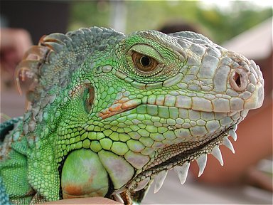
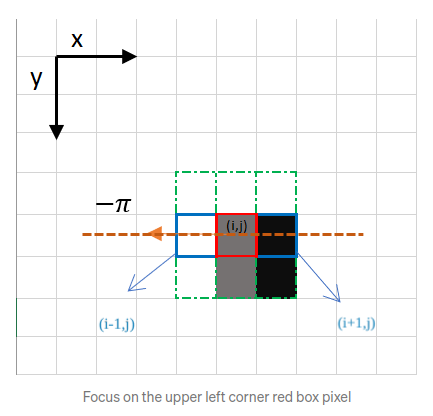

# Canny Edge Detector

Il Canny Edge Detector è un algoritmo per la rilevazione dei bordi in immagini a scala di grigi sviluppato da John F. Canny nel 1986. Il suo funzionamento è basato su 5 fasi:
    
      1. Riduzione del rumore
      2. Calcolo del gradiente
      3. Non-Maximum Suppression
      4. Doppia soglia
      5. Tracciamento dei bordi per isteresi

Dopo aver eseguito tutti i passi, dovreste essere in grado di ottenere il seguente risultato:

Immagine Originale | Immagine Finale
:-----------------: | :-----------------:
 | 

# 0. Setup
Copiate i vostri file `process_image.cpp` e `filter_image.cpp` nella cartella `./src/`.

# 1. Riduzione del rumore
Il primo passo è la riduzione del rumore dell'immagine applicando un filtro Gaussiano. Per farlo, utilizzate le funzioni che avete sviluppato nel homework 2, e completate la funzione `smooth_image()`.

Usando un filtro Gaussiano di dimensione 9x9 e deviazione standard σ=1.4, il risultato finale dovrebbe essere:

Immagine Originale | Immagine Sfocata
:-----------------:|:------------------:
 | 

# 2. Calcolo del gradiente

Il secondo passo consiste nell'identificare l'intensità e la direzione dei bordi nell'immagine. Questo si può ottenere calcolando il gradiente dell'immagine. Lo step 1 è necessario perché i gradienti sono molto sensibili al rumore. Per calcolare il gradiente, completate la funzione `compute_gradient()`. Potete utilizzare la funzione sobel che avete sviluppato nel homework 2, ricordando di normalizzare l'ampiezza del gradiente.

Dopo questo step dovreste ottenere:

Immagine Sfocata | Intensità del gradiente
:-----------------:|:------------------:
 | 

# 3. Non-Maximum Suppression

L'ampiezza del gradiente ha messo in evidenza i bordi, ma questi sono troppo spessi e sfocati. Questo step ha lo scopo di ridurre la larghezza dei bordi e di renderli più definiti. Fondamentalmente, questo è fatto preservando i pixel che sono localmente massimi lungo la direzione del bordo ed eliminando tutti gli altri pixel.

Faremo una semplificazione rispetto all'implementazione originale dell'algoritmo che avete visto a lezione.

Nel nostro caso, invece di utilizzare direttamente la direzione del gradiente, la arrotondiamo al multiplo di 45° più vicino. Poi consideriamo i valori dei due pixel vicini lungo questa direzione. In pratica, invece di ottenere i valori p ed r per interpolazione, stiamo usando l'approccio nearest neighbor.

Più precisamente, per ogni pixel:
* Si arrotonda la direzione del gradiente al più vicino multiplo di PI/4.
* Se il pixel è maggiore dei suoi vicini lungo questa direzione, allora viene mantenuto, altrimenti viene eliminato.

Facciamo un semplice esempio:

Il riquadro rosso in alto a sinistra rappresenta un dell'immagine contenente l'ampiezza del gradiente mentre la direzione del gradiente è rappresentata dalla freccia arancione, in questo caso con un angolo di -pi radianti (+/-180 gradi).

La direzione del bordo è la linea orizontale tratteggiata arancione. Lo scopo dell'algoritmo è verificare se il pixel nella stessa direzione sono più o meno intensi di quello in elaborazione. Nell'esempio sopra, il pixel (i, j) viene elaborato e i pixel nella stessa direzione sono 
evidenziati in blu (i-1, j) e (i+1, j). Se uno di questi due pixel è più intenso di quello in 
elaborazione, viene mantenuto solo quello più intenso. Il pixel (i-1, j) sembra essere più intenso, 
perché è bianco. Quindi, il valore di intensità del pixel corrente (i, j) è impostato su 0. 
Se non ci sono pixel nella direzione del bordo con valori più intensi, il valore del pixel corrente 
viene mantenuto.

Vediamo ora un altro esempio:

In questo caso la direzione è la linea diagonale tratteggiata arancione. Pertanto, il pixel più intenso 
in questa direzione è il pixel (i+1, j-1).

Per implementare questo step, completate la funzione `non_maximum_suppression()`. Dovreste ottenere:

Intensità del gradiente | Non-Maximum Suppression
:-----------------:|:------------------:
 | 

# 4. Doppia soglia
Questo step ha l'obiettivo di identificare 3 tipi di pixel: forti, deboli e non rilevanti:

* I pixel forti hanno un valore di intensità maggiore di una soglia alta (high threshold) e sono considerati come bordi.
* I pixel non rilevanti hanno un valore di intensità minore di una soglia bassa (low threshold) e sono considerati non rilevanti per il bordo.
* I pixel deboli hanno un valore di intensità compreso tra le soglie bassa e alta e sono considerati come bordi solo se sono connessi a pixel forti, altrimenti sono considerati non rilevanti. Questa operazione verrà eseguita nel prossimo step tramite il tracciamento dei bordi per isteresi.

Per implementare questo step, completate la funzione `double_thresholding()`. Il risultato di questo step è un'immagine con 3 valori di intensità: 0, 0.25 e 1.0. I pixel con valore 0 sono quelli non rilevanti, quelli con valore 1.0 sono quelli forti e quelli con valore 0.25 sono quelli deboli:

Non-Maximum Suppression | Doppia soglia
:-----------------:|:------------------:
 | 

# 5. Tracciamento dei bordi per isteresi

Lo step successivo consiste nel trasformare i pixel deboli in pixel forti, se e solo se sono connessi a pixel forti. In caso contrario, questi pixel vengono impostati a 0.

Per implementare questo step, completate la funzione `edge_tracking()`. Dovreste ottenere:

Doppia soglia | Immagine finale
:-----------------:|:------------------:
 | 