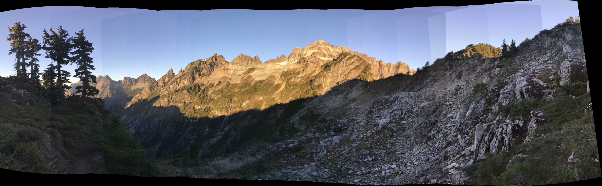
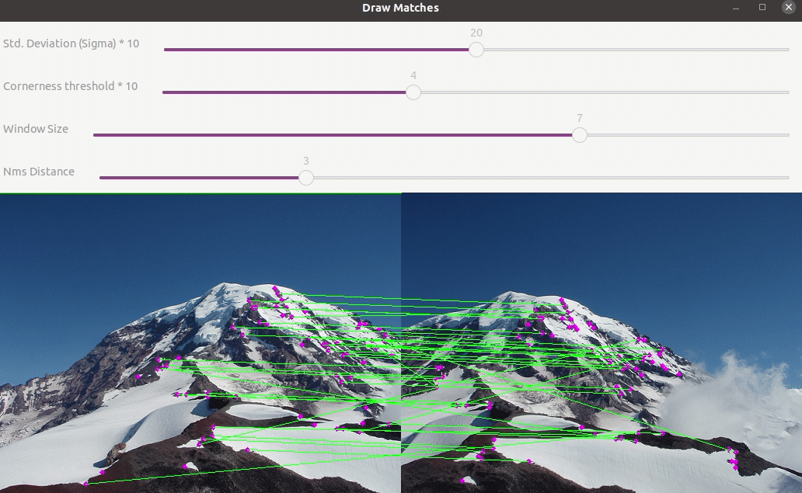
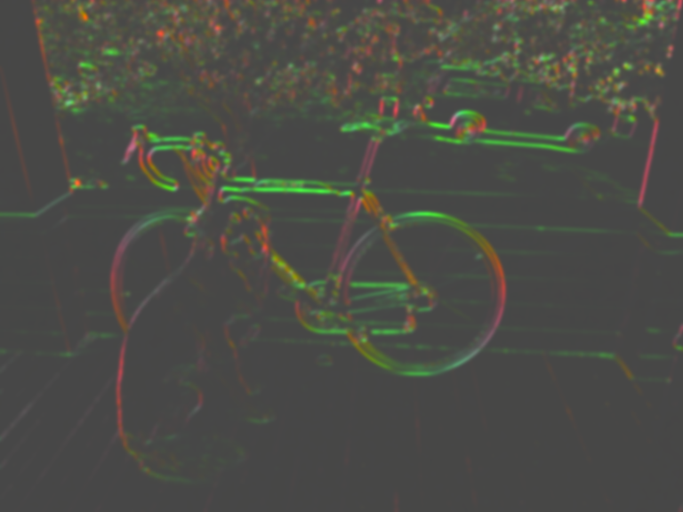
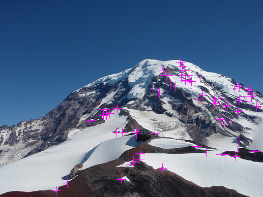
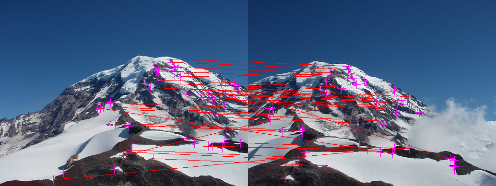
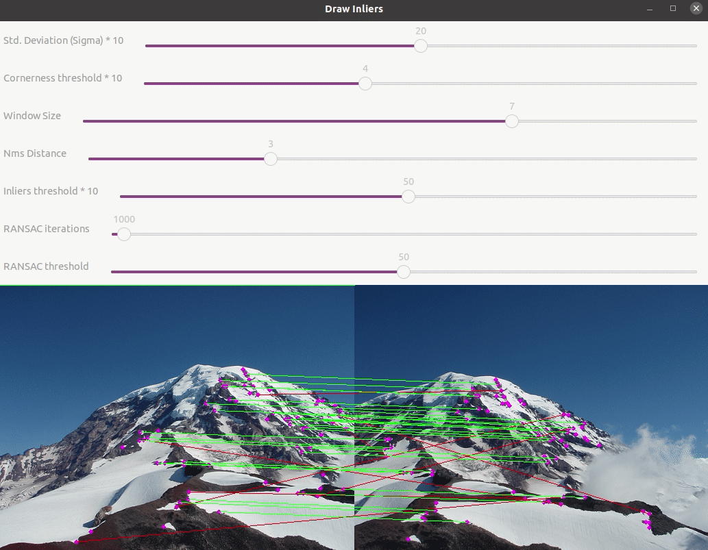
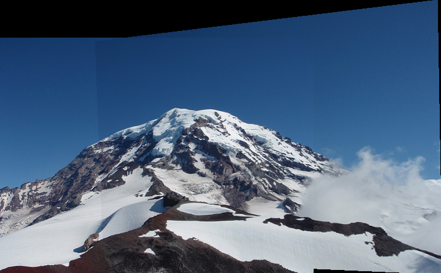

# Esercitazione 4 parte 1 #

Per questa esercitazione utilizzerete i risultati delle prime due 
esercitazioni, più precisamente i file `process_image.cpp`, `filter_image.cpp` e `resize_image.cpp`. Vengono forniti i file di soluzione già inclusi, 
ma potete sovrascriverli con i vostri se volete. Oltre a questo, troverete i `test1` e 
`test2` per verificare che tutto funzioni (tutti i test devono passare). 

`test4` invece è il programma che produrrà la foto panoramica basata sulla 
vostra implementazione dei vari algoritmi necessari, oltre ad effettuare 
qualche test. 

Le funzioni di timing possono essere rimosse aggiungendo `#define TIME(a)` 
alla fine di `utils.h`

## Creare un panorama ##

Questa prima parte dell'esercitazione 4 copre gli algoritmi per estrarre i
punti salienti (key points) di un'immagine, e per effettuare il matching con quelli di un'altra immagine. 
Nella seconda parte implementerete la trasformazione di un immagine 
nell'altra, creando il panorama.

L'algoritmo di alto livello è già implementato, si trova nel file 
`src/panorama_image.cpp`. La sua struttura è approssimativamente questa:

    Image panorama_image(const Image& a, const Image& b, float sigma, int corner_method, float thresh, int window, int nms, float     inlier_thresh, int iters, int cutoff, float acoeff)
      {
      // Calculate corners and descriptors
      vector<Descriptor> ad = harris_corner_detector(a, sigma, thresh, window, nms, corner_method);
      vector<Descriptor> bd = harris_corner_detector(b, sigma, thresh, window, nms, corner_method);

      // Find matches
      vector<Match> m = match_descriptors(ad, bd);

      // Run RANSAC to find the homography
      Matrix Hba = RANSAC(m, inlier_thresh, iters, cutoff);

      // Stitch the images together with the homography
      return combine_images(a, b, Hba, acoeff);
      }

I corner verranno estratti con un Harris corner detector. Quinidi faremo il 
matching di questi punti. Nella seconda parte dell'esercitazione vedremo gli 
altri passi in dettaglio.

## 0. Visualizzazione interattiva con OpenCV ##
Per poter fare debugging introduciamo le funzioni `detect_and_draw_corners` 
e  `find_and_draw_matches` che visualizza i risultati delle funzioni che 
implementerete. Inoltre, in questa esercitazione vi sara' la possibilita' di visualizzare gli output in maniera interattiva usando OpenCV:

OpenCV (Open Source Computer Vision Library) [OpenCV Homepage](https://opencv.org/) è una libreria di elaborazione delle immagini e della visione artificiale open-source. È scritta in C++, ma esiste anche una versione Python chiamata cv2. Questo potente strumento è utilizzato in una vasta gamma di applicazioni inerenti la computer vision, tuttavia noi la utilizzeremo solo parzialmente. Infatti la useremo solamente per costruire una GUI personalizzata e interattiva, mediante la quale possiamo cambiare manualmente i parametri di nostro interesse, andando verificare i cambiamenti delle immagini in tempo reale.

### 0.1 Installazione ###
## Repository ufficiale
Nella macchina virtuale BIAR 4.3 la versione di opencv disponibile è la 3.2. 
Per installarla da terminale dovete eseguire questi comandi:

    sudo apt update
    sudo apt install libopencv-dev libopencv-core3.2
    
ovviemente utilizzando la password della macchina virtuale quando vi viene richiesta. Per altri sistemi linux, il procedimento è analogo.

## Source
Per l'installazione faccio riferimento alla pagina ufficiale di OpenCV dove troverete oltre alle istruzioni di installazione, una collezione molto ampia di tutorial che vi spiega nel dettaglio come utilizzare questo strumento. [OpenCV Tutorials](https://docs.opencv.org/3.4/df/d65/tutorial_table_of_content_introduction.html).

Prima di tutto installate i componenti fondamentali (necessitate solo di quelli con la flag compiler e required, degli optional potete farne a meno).

    [compiler] sudo apt-get install build-essential

    [required] sudo apt-get install cmake git libgtk2.0-dev pkg-config libavcodec-dev libavformat-dev libswscale-dev

    [optional] sudo apt-get install python-dev python-numpy libtbb2 libtbb-dev libjpeg-dev libpng-dev libtiff-dev libjasper-dev libdc1394-22-dev

Clonate la repository di OpenCV nella directory del progetto:

    cd ~/<my_working_directory>
    git clone https://github.com/opencv/opencv.git

Compilate OpenCV usando CMake

    cd ~/opencv
    mkdir build
    cd build

    cmake -D CMAKE_BUILD_TYPE=Release -D CMAKE_INSTALL_PREFIX=/usr/local ..
    make -j4

Per problemi fate riferimento alla guida ufficiale che trovate sul sito di OpenCV, contiene molte soluzioni per problemi specifici, leggetela bene. In caso non riusciate comunque ad installarlo venite pure a chiedere.

### 0.2 Set-up ###
Installare OpenCV dovrebbe essere sufficiente per renderlo disponibile per il progetto. Se tutto va bene ed OpenCV viene trovato dal sistema dovreste avere questo output quando eseguite `./compile.sh`:

    ---------------------------------------------
    OpenCV found!!!!
    Building WITH Visualization
    ---------------------------------------------

Buon lavoro!

## 1. Harris corner detection ##

L'algoritmo fondamentale è questo:

    Calcolo delle derivate Ix e Iy
    Calcolo delle componenti IxIX IyIy e IxIy
    Calcolo della matrice di struttura come somma pesata delle misure adiacenti.
    Calcolo dei corner usando la funzione R = det(S)/tr(S), oppure estraendo 
        il 2° autovalore
    Utilizzare non-max suppression per ottenere i corner

## 1.1 Calcolo della matrice di struttura ##

Completate la funzione `Image structure_matrix(const Image& im2, float sigma)`
 in `harris_image.cpp`. Questa effettua i primi tre step dell'algoritmo: 
calcolo delle derivate, calcolo dei fattori e somma pesata delle derivate 
adiacenti. __NB: Questa somma pesata può ottenersi facilmente con un blur 
Gaussiano.__ Oltre a questo, fate caso che nella funzione `structure_matrix` 
i valori della matrice S dovrebbero essere salvati in una struttura di tipo 
`Image`. Questo non è semplicemente un fatto di circostanza: salvare i 
valori Ix^2, Iy^2 e IxIy nei canali R, G e B della `Image S(...)` permette 
poi di fare la convoluzione con la gaussiana in un colpo solo grazie alle 
funzioni già implementate.  
Per i gradienti usate lo stesso tipo di codice usato per il filtro di sobel, 
come avete fatto nell'esercitazione 3 sul Canny Edge detector. 

Potete visualizzare il risultato salvato da `test4` con il nome di 
`output/structure.png` e confrontarlo con il riferimento `data/structure.png`:

### 1.1b rendere più veloce lo smoothing ###

Per rendere l'implementazione più efficiente,
usate la proprietà di separabilità del filtro gaussiano, implementando un 
filtro monodimensionale e applicandolo prima alle righe e poi alle colonne.
In questo modo, invece di usare un filtro NxN bidimensionale, ne userete due 
1xN e Nx1.

Completate `Image make_1d_gaussian(float sigma)` e 
`Image smooth_image(const Image& im, float sigma)` .

## 1.2 Calcolare i candidati (cornerness function) a partire dealla matrice S ##

Completate la funzione `Image cornerness_response(const Image& S, int method)`. 
Ritornate `det(S)/tr(S)` per ciascun pixel. A lezone abbiamo visto funzioni 
di _cornerness_ basate `R = min(s_1, s_2)` e `R = det(S) - tr(S)^2`. Quella 
che usiamo qui è una nuova variante, `R = det(S)/tr(S)`. La 
funzione si aspetta un parametro `method`. A seconda se valga 0, 1 o 2 
potete scegliere uno dei tre metodi. Per iniziare comunque implementate 
l'ultimo (`det(S)/tr(S)`).

## 1.3 Non-maximum suppression ##

Completate `Image nms_image(const Image& im, int w)`.

A differenza della soluzione del Canny Edge detector, in questo caso 
implementiamo un NMS più semplice. Per ogni pixel, controllate tutti i pixel a 
distanza `w`, vale a dire tutti i pixel in una finestra di dimensioni `2w+1` 
attorno a ciascun pixel. Se uno qualunque dei pixel nella finestra ha 
intensità maggiore di quello centrale, impostate quest'ultimo ad un numero 
negativo molto basso e passate al successivo.

## 1.4 Completate l'Harris detector ##

> NB: la funzione che vogliamo implementare utilizza due elementi del C++ che 
non è detto che conosciate: la struttura adati `vector` che fa parte della 
Standard Template Library del C++ e i Template. La prima è semplicemente una 
struttura dati dinamica che gestisce da sola la memoria. In pratica è come 
una `list` di python, per semplificare molto la questione. I Template invece 
sono uno strumento del linguaggio C++ per gestire tipi diversi e arbitrari. 
In questo caso noi vogliamo un array di *descrittori*, e questo si indica in 
C++ così: `vector<Descriptor>`. Chiaramente `Descriptor` deve essere un tipo 
di dato valido nel contesto del progetto, cioè deve esistere una class o una 
struct che lo definisce. 

Completate le parti mancanti di `vector<Descriptor> detect_corners(const Image& im, const Image& nms, float thresh, int window)`.
La funzione dovrebbe ritornare un vector di descrittori dei corner 
dell'immagine. Il codice che calcola i descrittori è fornito, ma potete 
variare la dimensione della finestra attorno ogni corner trovato usando il 
parametro `window`.

Una volta completata questa funzione dovreste riuscire a calcolare le 
feature dell'immagine. Provare a eseguire queste linee di codice:

    Image im = load_image("data/Rainier1.png");
    Image corners=detect_and_draw_corners(im, 2, 0.2, 5, 3, 0);
    save_image(corners, "output/corners");

Queste dovrebbero individuare i corner usando una finestra gaussiana di 2 
sigma, una threshold di 100 e una distanza di nms di 3 (cioè una finestra di 
7x7). Dovreste avere un risultato simile a questo:

Gli angoli sono evidenziati con le croci. Sembra che l'algoritmo sia mollto 
sensibile, in quanto ci sono molti corner vicino ai punti dove la neve 
incontra la roccia. Provate a giocare con i parametri per vedere cosa succede.

## 1.5 Visualizzazione interattiva con OpenCV (Harris detector) ##
Se avete installato correttamente OpenCV, potete sfruttare la prima delle visualizzazioni interattive. Sara' sufficiente eseguire dall directory del progetto:

    ./interactive_visualization/harris 

A questo punto l'interfaccia che dovremmo vedere dovrebbe essere questa, da cui è possibile modificare i parametri in tempo reale per capire più a fondo che effetto hanno sul risultato:

## 2 Patch matching ##

Per ottenere un panorama dobbiamo effettuare un 
accoppiamento (matching) dei corner estratti dalle due immagini. Come già 
detto il codice per calcolare il descrittore è già stato scritto per voi. 
Consiste nella vettorizzazone dei pixel adiacenti a quello centrale, ma 
sottraendo il valore di quest'ultimo. Questo ci da un minimo di invarianza 
all'illuminazione. Fate attienzione che il descrittore `Descriptor 
describe_index(const Image& im, int x, int y, int w)` prende come parametro 
anche la finestra di dimensione del descrittore.

Il resto dell'esercizio consiste nella modifica del file `src/panorama_image.cpp`.

## 2.1 funzione di distanza ##
Per confrontare le patch useremo la distanza L1. La distanza L2 può dare 
problemi con gli outliers che potrebbero esserci, in quanto enfatizza le 
distanze di questi e le fa pesare molto rispetto agli altri.

Implementate `float l1_distance(float *a, float *b, int n)` che calcola la 
distanza tra due vettori di float. In questo caso i vettori sono 
rappresentati come semplici puntatori e non con `std::vector`, quindi anche 
la lunghezza `n` dei vettori viene passata.

## 2.2a Trovare il miglior accoppiamento tra A e B ##

Per calcolare il miglior accoppiamento, dobbiamo scorrere tra i descrittori 
dell'`Image a` e trovare per ciascuno il descrittore più vicino dall'`Image 
b`. Completate `vector<int> match_descriptors_a2b(const vector<Descriptor>& a, const vector<Descriptor>& b)`.

## 2.2b Eliminare le coppie non simmetriche  ##

La funzione `match_descriptors_a2b` trova il descrittore più vicino in `b` a 
partire da `a`, ma se ci riflettete, questo accoppiamento non è 
necessariamente simmetrico, in quanto da un vantaggio ai descrittori che 
vengono considerati per primi. Per mitigare questo effetto, una approccio 
standard è calcolare l'accoppiamento anche tra `b` a `a`, mantenendo alla 
fine solo gli accoppiamenti che sono verificati in due direzioni. 

Una volta fatto questo potete mostrare i matches tra le immagini:

    Image a = load_image("data/Rainier1.png");
    Image b = load_image("data/Rainier2.png");
    Image m = find_and_draw_matches(a, b, 2, 0.4, 7, 3, 0);
    save_image(m, "output/matches");

Che dovrebbe darvi:

## 2.2c Visualizzazione interattiva con OpenCV (Matches)  ##
In maniera simile a prima, a questo punto se avete implementato tutto correttamente, avrete a disposizione un'ulteriore visualizzazione interattiva con OpenCV. Per visualizzarla, sarà sufficiente eseguire dall directory del progetto:

    ./interactive_visualization/matches 

A questo punto l'interfaccia che dovremmo vedere dovrebbe essere questa, da cui è possibile modificare i parametri in tempo reale per capire più a fondo che effetto hanno sul risultato:

Anche qua, in maniera simile a prima provate a giocare con i parametri per vedere come cambiano gli accoppiamenti.

## 3. Trovare la trasformazione omografica ##

Come abbiamo visto a lezione, per quanto buono possa essere il descrittore 
che usiamo, ci sarà sempre qualche match sbagliato. Ad esempio, ricordate 
l'immagine dello steccato e di come ciascuna parte dello stesso sia 
visivamente identica alle altre. Per questo motivo, oltre al matching 
simmetrico, implementeremo ora un check geometrico molto utile in questo e 
in tanti altri casi. Lo scopo di questo check non sarà correggere i match, 
ma eliminare quelli grossolanamente sbagliati, gli outliers. 

## 3.1 Proiettare i punti con una omografia ##

Implementate `Point project_point(const Matrix& H, const Point& p)` per 
effettuare la proiezione dei punti tramite la matrice `H`. Questa funzione 
sarebbe molto difficile da implementare senza una libreria di linear algebra 
che fornisca le operazioni fondamentali di calcolo matriciale. In questo 
caso trovate tutte le risorse di cui avete bisogno nel file `src/matrix.h` and 
`src/matrix.cpp`. Ricordaatevi di utilizzare le coordinate omogenee e di 
normalizzarle quando ritornate alle coordinate normali.

## 3.2a  Calcolare le distanze tra i punti ##

Completate `double point_distance(const Point& p, const Point& q)` con la 
diatanza L2.

## 3.2b Calcolate gli inliers ##

Cercate di identificare gli inliers tra i match trovati. Completate 
`vector<Match> model_inliers(const Matrix& H, const vector<Match>& m, float 
thresh)` inserendo un loop su tutti i punti, proiettando usando una 
omografia, e testando se i punti proiettati candon entro una certa soglia di 
distanza dal punto di match nell'altra immagine. Ritornate il 
`vector<Match>` degli inliers.

## 3.2c Visualizzazione interattiva con OpenCV (Inliers) ##
Arrivati a questo punto, potete sfruttare un'ulteriore interfaccia interattiva basata su OpenCV. Per visionarla, sarà sufficiente eseguire dall directory del progetto:

    ./interactive_visualization/inliers 

Le linee verdi rappresentano gli accoppiamenti "positivi", mentre quelle rosse quelli "negativi". Infatti se notate bene, le linee verdi sono quelle che tendono ad essere più parallele tra loro, in quanto rappresentano una trasformazione coerente tra loro.

Anche qua, in maniera simile a prima provate a giocare con i parametri per vedere come cambiano gli accoppiamenti.

## 3.3 Campionamento casuale dei match ##

Uno degli step in RANSAC è quello di pescare casualmente le coppie di punti 
per stimare un nuovo modello di trasformazione. Un modo semplice per farlo è 
quello di mischiare l'array di matches e quindi prendere i primi `n` 
elementi per fare la stima del modello. 

Implementate il metodo [Fisher-Yates shuffle](https://en.wikipedia.org/wiki/Fisher%E2%80%93Yates_shuffle#The_modern_algorithm) in `void randomize_matches(vector<Match>& m)`.

## 3.4 Fitting dell'omografia ##

Cacoleremo l'omografia usando la soluzione del sistema `Ax=b` come visto a 
lezione. Nel caso della funzione `Matrix compute_homography_ba(const vector<Match>& matches)`
la matrice `A` è chiamata `M`, ma il significato è lo stesso. La maggior 
parte della funzione è già implementata, l'unica cosa da fare è impostare 
bene i contenuti delle matrici `M` e `b`.

Per risolvere utilizzate la funzione opportuna in `matrix.h` e poi riportate 
la soluzione in formato 3x3 prima di ritornare la matrice.

## 3.5 Implementare RANSAC ##

Implementate l'algoritmo RANSAC discusso a lezione. Completate la funzione 
`Matrix RANSAC(vector<Match> m, float thresh, int k, int cutoff)` seguendo 
lo pseudo codice.

## 3.6 Fondere le immagini con una omografia ##

Ora è venuto il momento d'incollare le immagini insieme utilizzando 
l'omografia. Questa parte dell'esercitazione richiede di completare la 
funzione `Image combine_images(const Image& a, const Image& b, const Matrix& Hba, float ablendcoeff)`.

Parte della funzione è già implementata. Il primo passo è capire quanto sarà 
grande l'immagine finale per poter creare una "tela" che le contenga entrambe. 
Per capirlo proietteremo gli angoli dell'immagine `b` nel sistema di 
coordinate di `a` usando `Hinv`. Dopodiché potremo dedurre le 
nuove coordinate e dove va messa `Image a` all'interno della nostra 
nuova tela. Una volta capito questo, copiate l'immagine sulla tela.

Più in dettaglio sarà necessario fare un ciclo su tutti i pixel dell'immagine 
`a` per vedere se una volta mappati nelle coordinate di `b` rientrano 
nell'ìmmagine finale. I pixel che effettivamente vengono mappati 
nell'immagine dovranno essere copiati, ma il loro colore dovrà tenere conto 
dei pixel adiacenti già presenti dell'immagine `b`, vale a dire che dovrete 
calcolare l'intensità dei colori con una interpolazione bilineare 
(naturalmente avere implementato già questa funzione in una esercitazione 
precedente).

Nei punti in cui l'immagine si sovrappone, dovrete implementare una forma di 
"blending". Quello che faremo sarà utilizzare una combinazione convessa dei 
due pixel di `a` e `b`, vale a dire che i valori delle due immagini verranno 
pesati con coefficienti `ablendcoeff` e `1-ablendcoeff`.

Se tutti questi passaggi verranno completati correttamente, dovreste 
riuscire a creare un panorama con queste linee di codice:

    Image im1 = load_image("data/Rainier1.png");
    Image im2 = load_image("data/Rainier2.png");
    Image pan=panorama_image(a,b,2,0,0.3,7,3,5,1000,50,0.5);
    save_image(pan, "easy_panorama");

## 3.2c Visualizzazione interattiva con OpenCV (Panorama) ##
Benvenuti all'ultima visualizzazione interattiva. Questa volta andremo a visualizzare il "panorama" che consiste nel mettere insieme due immagini della stessa montagna prese da due punti di vista differenti.

    ./interactive_visualization/panorama 

Anche qua, in maniera simile a prima provate a giocare con i parametri per vedere come cambia il risultato finale.
