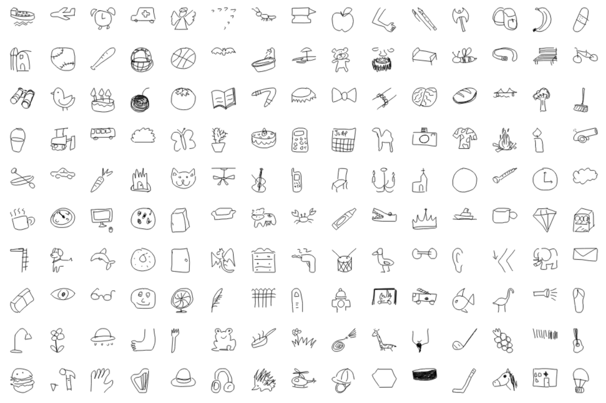

# Esercitazione 8

Questa è l'ulima esercitazione per l'anno accademico 22-23. Rispetto alla teoria, siamo riusciti a coprire molti 
concetti di supervised learning in generale e con le reti neurali. Le ultime lezioni vi servono ad approfondire 
alcuni concetti importanti nella pratica di addestramento di modelli complessi come le CNN. 

Detto questo, l'esercitaizone prevede una parte di tutorial, che mutuiamo di nuovo dall'Università di Amsterdam, e 
un esercizio vero e proprio, che rappresenta la sfida più impegnativa per questa parte di corso:

## Tutorial
I tutorial che vi proponiamo possono essere trovati in originale in questo sito web. Di seguito una breve 
discussione del perché pensiamo sia importatne per voi studiarli e provare ad implementarli:
 1. [Ottimization and initialization](tutorials/Optimization_and_Initialization.ipynb): questo script vi permette di mettere le mani sui concetti che avete visto 
    riguardo all'inizializzazione dei parametri nelle reti neurali e il loro effetto sull'addestramento. Dato che in 
    pytorch, quando addestrate una rete nurale da zero, potete decidere quale tecnica di inizializzazione usare, è 
    importante avere le idee chiare sui loro effetti. Oltre a questo, il tutorial parla anche degli algoritmi di 
    ottimizzaizone, vale a dire SGD con momentum e ADAM. Questi hanno una grande influenza sull'addestramento, anche 
    perché la learning rate è uno degli iper-parametri che maggiormente impatta la convergenza dell'addestramento. 
2. [Inception Net e ResNet](tutorials/Inception_ResNet_DenseNet.ipynb): questo tutorial vi accompagna nell'implementazione da zero delle architetture notevoli 
   che abbiamo visto a lezione. Non abbiamo avuto il tempo di fare un'esercitazione specifica sull'assemblaggio di 
   reti convoluzionali, ma alla fine l'aspetto tecnico può essere ben appreso proprio replicando le strutture più 
   efficaci della letteratura. Vi consiglio quindi di provare ad implementare questi blocchi voi stessi, per 
   diventare capaci di svolgere le tesine richieste per l'esame. 

## Esercizio
L'esercizio proposto per questo laboratorio è l'addestramento di un classificatore di "schizzi", utilizzando 
l'eccellente [The Quick, Draw! Dataset](https://quickdraw.withgoogle.com/data), che è composto interamente da 
disegni di questo tipo:

Come potete leggere dalla [descrizione su github](https://github.com/googlecreativelab/quickdraw-dataset), 
questi disegni sono stati prodotti tramite un gioco (che potete anche giocare cliccando 
[qui](https://quickdraw.withgoogle.com/)) e raccolti per scopi accademici. Il numero di categorie di oggetti è 
**345** e il numero di sample è (circa?) **50 milioni**.
Il dataset è fornito in diversi formati:

- **[raw](https://console.cloud.google.com/storage/browser/quickdraw_dataset/full/raw)**: Contiene in formato ndjson il disegno annotando anche l'ordine dei tratti. Noi non abbiamo trattato 
  l'analisi delle serie temporali con Recursive neural networks (RNN), ma c'è la possibilità per chi desiderasse. 
  Oltre all'immagine, ci sono altri metadati importanti, tra cui la categoria (che potrebbe essere la label della 
  classe).
- **preprocessed**: Contiene il dataset diviso nelle 345 categorie di immagini, per facilitare lo scaricamento, e in 
  formati diversi. 
  - [Simplified Drawing Files (SDF)](https://console.cloud.google.com/storage/browser/quickdraw_dataset/full/simplified): sempre in formato ndjson, le immagini sono 256x256 e hanno gli stessi metadati. È 
    stata rimossa l'informazione temporale dei tratti e sono state effettuate delle operazioni per 
    semplificare le linee.
  - [Binary files](https://console.cloud.google.com/storage/browser/quickdraw_dataset/full/binary): come sopra, ma in un formato binario custom che le comprime un po'. Il parser di questo formato lo 
    trovate nella descrizione. 
  - [Numpy bitmaps](https://console.cloud.google.com/storage/browser/quickdraw_dataset/full/numpy_bitmap): si tratta di versioni scalate a 28x28 pixels dei SDF. E ovviamente sono in formato numpy (.npy). 

Tutti questi formati sono scaricabili, classe per classe, dai link che vi ho fornito nella descrizione di ciascuno, 
ma non vi serviranno tutti. È venuto ora il momento di descrivere l'esercizio:

## Sviluppo di un classificatore di disegni basato su CNN
Il vostro mandato è quello di implementare e addestrare un classificatore di disegni utilizzando il dataset 
descritto sopra. In particolare dovrete assicurarvi che la vostra soluzione abbia le seguenti caratteristiche:

1. Dovrete utilizzare una rete backbone di quelle viste a lezione, preaddestrata su ImageNet, e fare transfer 
   learning per questo problema. 
2. Il dataset è troppo grande per essere gestito tutto in un computer portatile (a meno che non abbiate qualcosa di 
   veramente fuori dal comune), quindi dovrete scegliere un numero inferiore di classi a vostra discrezione, ma _non 
   meno di 30_. Inoltre devono essere incluse le seguenti classi: camel, dog, face, horse, ice cream, moon, 
   microphone, onion, pillow, potato, pond e pool. Potete diecidere voi se lavorare con immagini 256x256 o 28x28. 
3. Dovete scrivere una classe pytorch Dataset da utilizzare nel Dataloader, come avete visto nelle esercitazioni 
   precedenti.
4. Dovete arrivare ad avere un sistema addestrato che non sia in overfitting o underfitting. 
4. Dovete dimostrare l'esplorazione di almeno due iperparametri, tra cui la learning rate, con esplorazione randomica.
5. Dovrete effettuare una failure analysis finale per essere capaci di discutere cosa il vostro sistema sa, o non sa 
   fare. 

Questi sono i requisiti minimi, ma se volete spingervi oltre, potete sbizzarrivi (esplorare diverse architetture, 
confrontare le performance di sistemi addestrati da zero, addestrare su tutte le classi, etc...).

